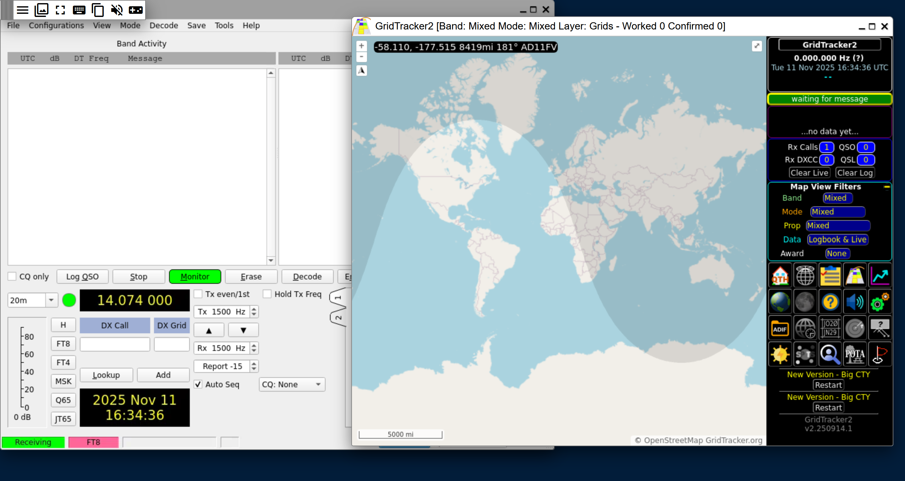
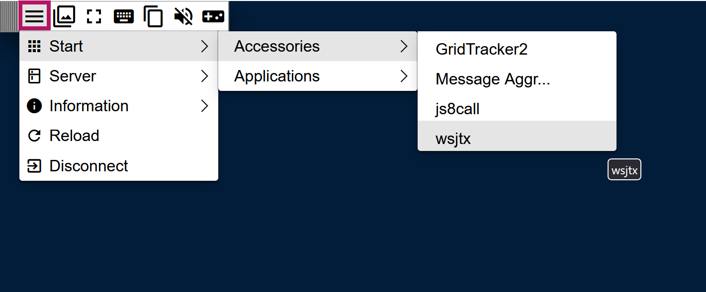
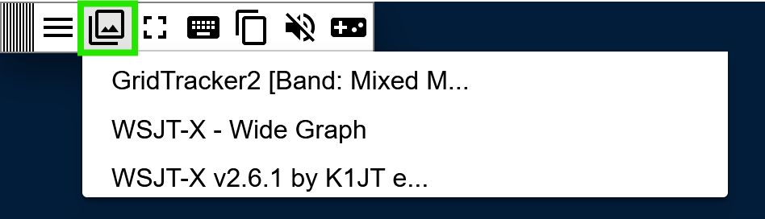

# digipanel-xpra Summary

Docker container running XPRA instance with WSJT-X, GridTracker2, and JS8Call. 

> [!WARNING]
> This container does NOT include hamlib rigctld instance.  It connects over a network to a working rigctld instance and DOES NOT work directly with serial for WSJT-X.

> [!NOTE]
> Sound is received via the host systems sound card. 

> [!TIP]
> Alsa cannot share sound cards when in use. Make sure no other application or container is using your radio sound card. 



> [!TIP]
> All WSJT-X and GridTracker2 settings are no different than when locally installed.

For general WSJT-X and GridTracker2 settings visit their respective webpages. 

# Launch

Clone the repository and run 

```
git clone https://github.com/hamMUSings/digipanel-xpra.git
cd digipanel-xpra
docker compose up -d
```

# XPRA Web Client Interface	

The panel will be available at http://YOUR.SERVER.IP.HERE:7300 

In general using the XPRA instance in the web page is just like on a desktop however there are a few subtle UI differences.

The first is the menu.  Menu items were created for WSJT-X, GridTracker2, and JS8Call.  So if you close the apps you are able to reopen them from this menu. Or in the case of JS8Call this is the only way to start using the application.



The seconds is the window switcher. In many UIs (Windows, GNOME, MacOS, etc) there is bar or dock on the top or bottom of the screen to move between windows. In XPRA it is under a menu item.  



> [!TIP]
> If you prefer non-web based more OS natural use of the apps see the [section below](#non-web-browser-use-&-dual-monitor-use)

# Non-Web Browser Use & Dual Monitor Use

If you desire to use the apps more natively looking on your client computer and/or use dual monitors you can install the XPRA client for your platform. This allows you to connect to the same session but will only bring the program windows to your machine letting them be moved to different monitors.

> [!IMPORTANT]
> JS8Call is not available in this mode

Use the following settings to connect to the XPRA instance in the digipanel.


For more information go to the [XPRA project page](https://xpra.org/index.html) and download the client for your platform.  

# Docker

Pre-built docker container can be found [here](https://hub.docker.com/r/hammusings/digipanel-xpra)
